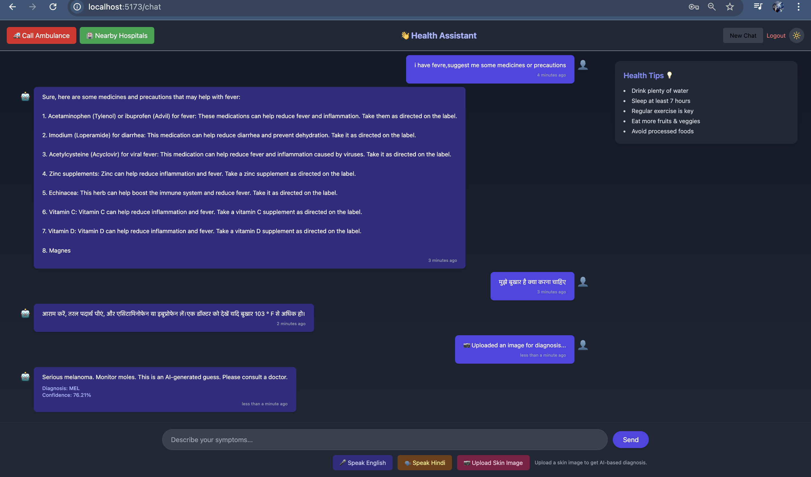
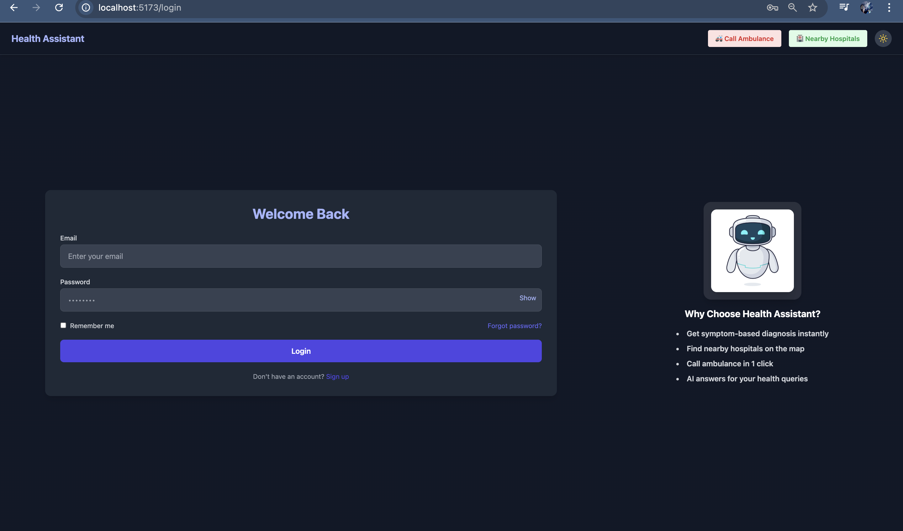
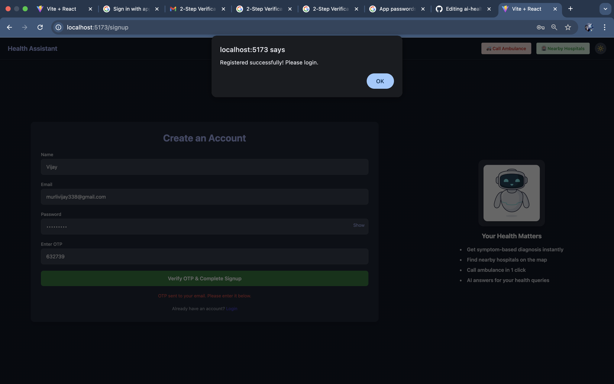

# 🩺 AI Health Assistant 🤖

> A full-stack MERN + Python-based AI Health Assistant that supports symptom-based queries, skin image diagnosis, multilingual voice input (English & Hindi), and stores user chat history.

---

## 🔍 Overview

This project simulates an AI-powered health assistant designed to **help users explore possible health issues** and **suggest basic information**, but **never diagnoses**. It also includes a **skin disease image classifier**, multilingual support, and **voice/text interaction**.

⚠️ **Note:** The live demo is currently under maintenance due to memory limits on free deployment platforms like Render. You can **run it locally** using the steps below.

---

## ✨ Features

✅ **Chatbot for Symptom Queries**  
✅ **Image-Based Skin Disease Classification**  
✅ **Multilingual Support (Hindi + English)**  
✅ **Voice Input & Text-to-Speech Output**  
✅ **User Authentication (Signup/Login)**  
✅ **Chat History per User**  
✅ **FAQ Matching using Sentence Similarity**  
✅ **Frontend: React + Redux Toolkit**  
✅ **Backend: Node.js + Express + Flask (AI)**  
✅ **Local LLM (TinyLLaMA) for offline AI replies**  
✅ **Skin Disease Detection using ResNet18**

---

## 🎥 Demo 

> ⚠️ Deployment on Render is currently facing memory issues.  
> 🔧 Please run locally for best results.

---

## 📸 Screenshots

| Symptom Chat | Login page | Signup page |OTP verification |
|--------------|---------------|-------------------|-------------------|
|  |  |  | |

---

## 🧠 Tech Stack

| Layer     | Tech Used                                        |
|-----------|--------------------------------------------------|
| Frontend  | React.js, Vite, Tailwind CSS, Redux Toolkit      |
| Backend   | Node.js, Express.js                              |
| AI Service| Flask, PyTorch, SentenceTransformers, TinyLLaMA |
| AI Models | TinyLLaMA, ResNet18 (skin), MiniLM (FAQ search)  |
| Voice     | Web Speech API (Browser), Google Translate API   |
| Auth      | JWT, bcrypt, MongoDB                             |


---

## 🚀 Run Project Locally

### 1️⃣ Clone the Repository

```bash
git clone https://github.com/Yogesh297/ai-health-assistant.git
cd ai-health-assistant
```

### 2️⃣ Start the Backend Server

```bash
cd server
npm install
npm run start
```

🛠️ Make sure to configure your `.env` file inside the `server/` directory:

```env
PORT=5000
MONGODB_URI=your_mongodb_uri
JWT_SECRET=your_jwt_secret
JWT_EXPIRE=30d
EMAIL_USER=your_email@gmail.com
EMAIL_PASS=your_app_password
```

### 3️⃣ Setup Frontend (/client)

```bash
cd ../client
npm install
npm run dev
```

### 4️⃣ Setup AI Service (/ai-service)

```bash
cd ../ai-service
pip install -r requirements.txt
python app.py
```

---

## 🧪 Model Info

- TinyLLaMA (local LLM from Hugging Face, quantized): Handles chatbot replies  
- ResNet18 trained on HAM10000: Predicts 7 skin conditions  
- SentenceTransformer (MiniLM): Used for matching FAQ-style queries

---

## 💡 Limitations

- Doesn’t provide actual diagnosis (just suggestions)  
- Render crashes if AI model memory exceeds free limits  
- Voice input limited to browsers that support Web Speech API

---

## 🙋‍♂️ How It Works

1. User logs in  
2. Types or speaks query (EN or HI)  
3. Flask server detects language → translates → runs LLM / FAQ search  
4. If image uploaded → AI classifies skin issue  
5. Reply is translated if needed → sent back to frontend  
6. Chat stored in JSON file per user

---

## 📁 Project Structure

```
ai-health-assistant/
├── client/         # React frontend
├── server/         # Express backend (auth, MongoDB)
├── ai-service/     # Flask app for AI logic
│   └── models/     # LLM & ResNet models (downloaded at runtime)
├── chat_logs/      # Stored user chat history
├── screenshots/    # UI demo images
└── README.md
```

---

## 🙌 Author

**Uttam**  
📧 uttamkaushik260@gmail.com
🔗 https://github.com/uttam2512/ai-health-project

